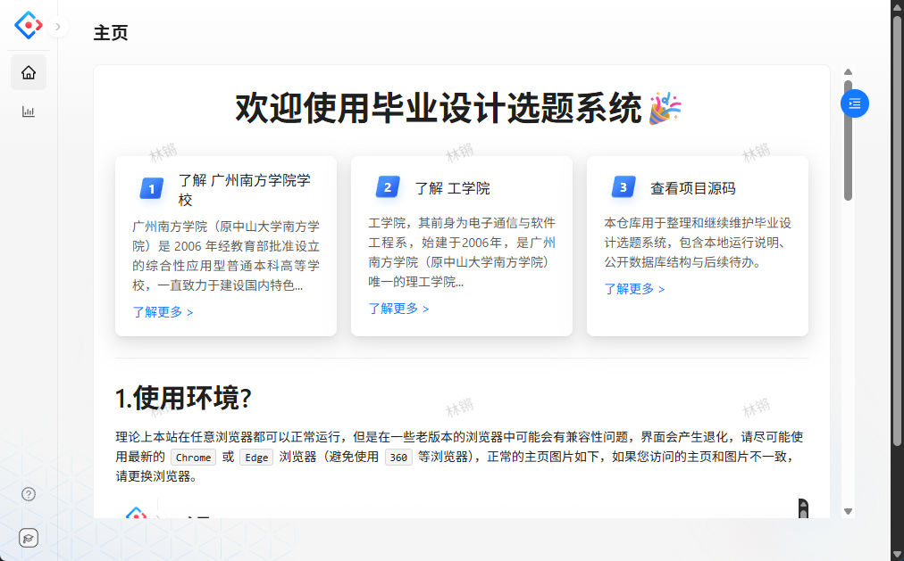
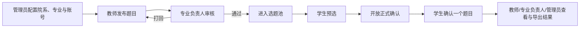
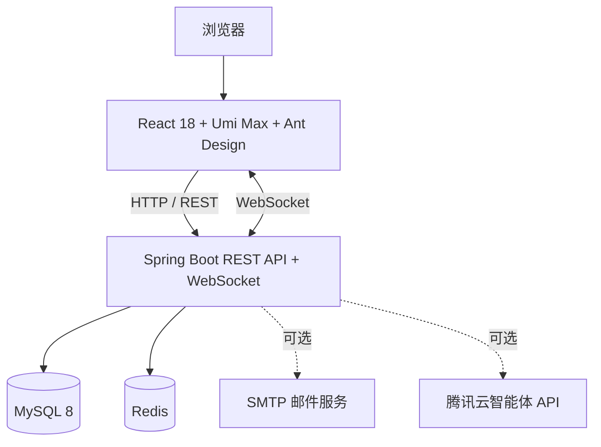

# 毕业设计选题系统

<div align="center">
  <strong>Graduation Topic Selection System</strong>
  <br />
  面向高校毕业设计选题全流程的前后端分离管理系统
</div>

<p align="center">
  <a href="https://github.com/Lq0412/graduation-topic-selection-system">项目主页</a>
  ·
  <a href="https://github.com/Lq0412/graduation-topic-selection-system/issues">问题反馈</a>
  ·
  <a href="./TODO.md">开发计划</a>
</p>

<p align="center">
  
  
  
  
  
</p>

> 将“组织配置 → 题目发布 → 系部审核 → 学生预选 → 开放确认 → 结果统计”串成一个可追踪、可管理的选题闭环。

## 项目简介

毕业设计选题系统是一套面向高校院系场景的 Web 管理系统，采用前后端分离架构，为学生、教师、专业负责人和系统管理员提供不同的业务工作台。

系统重点解决以下问题：

- 统一维护院系、专业、选题组和用户账号等基础数据；
- 将题目发布、审核、开放时间和学生选题过程集中管理；
- 支持“预选 → 正式确认”的分阶段选题流程，并处理并发选题；
- 通过统计面板、CSV 导入/导出和实时通知减少人工沟通成本；
- 在公开代码仓库中隔离真实名单、账号和服务凭据，便于学习、演示和二次开发。

> **项目定位**：这是个人毕业设计项目，适合教学演示、课程设计和功能二次开发。仓库不提供可直接登录的公开账号，也不建议未经安全加固就直接作为公网生产系统使用。

## 界面预览



> 截图来自仓库内置前端页面，仅用于展示系统布局和交互风格。

## 核心功能

### 按角色划分

| 角色 | 主要能力 |
| --- | --- |
| **学生** | 浏览符合本人院系/专业/选题组规则的题目；预选多个题目；在开放时间内确认一个题目；查看当前结果并按规则退选。 |
| **教师** | 发布、编辑和删除题目；提交系部审核；配置题目适用选题组；使用可选的 AI 辅助检查；查看已选学生并按权限处理退选。 |
| **专业负责人** | 审核本专业题目、填写打回理由；查看本系选题情况；导出统计结果；在满足条件时切换教师角色参与出题。 |
| **系统管理员** | 管理院系、专业、专业选题组和四类账号；调整教师出题/学生预选额度；配置选题时间窗、跨系规则和系统开关；查看全局统计并批量导入数据。 |

### 业务流程



### 特色能力

- **专业选题组**：每个专业可以配置一个选题组，教师可以为题目指定适用组；未设置组名的历史题目仍可兼容使用。
- **分阶段选题**：支持预选、正式确认、取消预选和退选等状态流转，避免将所有操作集中在单一时间点。
- **时间窗与系统开关**：管理员可以分别控制题目开放时间、跨系选题、查看题目和单选模式等规则。
- **跨系选题规则**：在开启跨系选题后，可按院系配置允许选择的范围。
- **批量数据处理**：提供学生、教师和题目导入模板，并支持选题情况 CSV 导出。
- **实时通知**：使用 WebSocket 推送系统消息、选题阶段变化和管理员通知。
- **可选外部服务**：可接入 SMTP 邮件服务和腾讯云智能体 API；未配置时不影响核心选题流程。
- **安全与一致性**：使用 BCrypt 保存密码，结合角色/对象级权限校验、限流、一次性验证码、事务、行锁和数据库唯一约束保护关键操作。

## 系统架构



- 前端负责页面、角色菜单、权限路由和交互体验；
- 后端负责认证、授权、业务规则、并发控制、文件处理和实时通知；
- MySQL 保存组织、账号、题目和选题关联数据；
- Redis 用于会话/认证相关数据、缓存和系统配置；
- 生产容器中可使用 Caddy 提供静态文件服务，并将 `/work_topic_selection_api` 代理到后端。

## 技术栈

| 层次 | 技术 |
| --- | --- |
| 前端 | React 18、Umi Max 4、Ant Design 5、Ant Design Pro Components、TypeScript、ECharts |
| 后端 | Java 8、Spring Boot 2.5.6、MyBatis-Plus、Sa-Token、Maven Wrapper |
| 数据与缓存 | MySQL 8、Redis、Caffeine |
| 接口与文件 | Knife4j / OpenAPI、Apache Commons CSV、EasyExcel |
| 实时与扩展 | WebSocket、SMTP、腾讯云智能体 API、Sentinel 限流 |
| 构建与部署 | pnpm 11.19.0、Docker、Caddy 2.10 |

## 仓库结构

```text
.
├── work-topic-selection-frontend/       # React + Umi 前端
│   ├── config/                          # 路由、运行配置和默认布局
│   ├── public/templates/                # CSV 导入模板
│   ├── public/steps/                    # 学生、教师、专业负责人使用手册
│   └── src/                             # 页面、组件和接口请求
├── work-topic-selection-backend/        # Spring Boot 后端
│   ├── src/main/java/                   # 控制器、服务、权限和基础设施
│   ├── src/main/resources/sql/          # 建库脚本、示例数据和历史迁移
│   └── src/test/                        # 单元测试和 H2 测试资源
├── deploy/                              # 生产 Docker Compose 部署套件、备份脚本与说明
│   └── migrations/                      # 面向已存在数据库的部署迁移
├── .env.example                         # 本地环境变量模板
├── build.sh                             # 构建前后端 Docker 镜像
├── env.sh                               # 将根目录 .env 导出到当前 Shell
├── TODO.md                              # 已完成整改、验证结果和后续计划
├── LICENSE                              # MIT License
└── README.md                            # 项目说明
```

## 快速开始

### 1. 准备环境

建议使用以下环境：

- JDK 8；
- MySQL 8.x；
- Redis；
- Node.js 24.x；
- pnpm 11.19.0；
- （可选）Docker Desktop，用于构建容器镜像。

后端已提交 Maven Wrapper，通常不需要单独安装 Maven。`env.sh` 和 `build.sh` 使用 Bash 语法；Windows 用户可以使用 Git Bash 或 WSL，也可以按下文的 PowerShell 方式加载环境变量。

### 2. 获取代码

```bash
git clone https://github.com/Lq0412/graduation-topic-selection-system.git
cd graduation-topic-selection-system
```

### 3. 创建并初始化数据库

先使用自己的 MySQL 管理账号创建数据库：

```sql
CREATE DATABASE work_topic_selection
  CHARACTER SET utf8mb4
  COLLATE utf8mb4_0900_ai_ci;
```

导入公开表结构：

```bash
mysql -u YOUR_MYSQL_USER -p work_topic_selection \
  < work-topic-selection-backend/src/main/resources/sql/schema.sql
```

如需本地演示数据，可继续导入完全虚构的示例数据：

```bash
mysql -u YOUR_MYSQL_USER -p work_topic_selection \
  < work-topic-selection-backend/src/main/resources/sql/demo-data.sql
```

`demo-data.sql` 不会创建可登录账号。首次启动时，如果数据库中还没有任何管理员，可以通过环境变量让后端一次性创建管理员账号，详见下一节。

#### 已有数据库的迁移

执行迁移前请先备份数据库，并根据数据库当前版本选择脚本：

```bash
# 旧版题目归属字段迁移（2026-08-28）
mysql -u YOUR_MYSQL_USER -p work_topic_selection \
  < work-topic-selection-backend/src/main/resources/sql/migration-20260828-teacher-account.sql

# 选题关联唯一约束迁移（2026-08-29）
mysql -u YOUR_MYSQL_USER -p work_topic_selection \
  < work-topic-selection-backend/src/main/resources/sql/migration-20260829-selection-uniqueness.sql

# 专业选题组字段迁移
mysql -u YOUR_MYSQL_USER -p work_topic_selection \
  < deploy/migrations/001_topic_group.sql
```

- 第一份脚本会尝试按“教师姓名 + 系部”回填旧题目的教师账号；脚本末尾列出的未匹配记录需要人工处理。
- 第二份脚本添加数据库级唯一约束；执行 `ALTER TABLE` 前，重复检查必须没有结果。
- 专业选题组迁移只增加可为空字段，不删除已有数据；全新数据库直接执行 `schema.sql` 即可，不需要再次执行该迁移。

### 4. 配置环境变量

复制环境变量模板：

```bash
cp .env.example .env
```

至少修改以下配置：

- `SPRING_DATASOURCE_USERNAME`
- `SPRING_DATASOURCE_PASSWORD`
- 如数据库不在本机，还需要修改 `SPRING_DATASOURCE_URL`
- 如 Redis 有密码，需要填写 `SPRING_REDIS_PASSWORD`

#### macOS / Linux / Git Bash / WSL

在准备启动后端的终端执行：

```bash
source ./env.sh
```

#### Windows PowerShell

PowerShell 不会自动读取 `.env`，可以在当前窗口执行下面的兼容导入片段：

```powershell
Get-Content .env | ForEach-Object {
  $line = $_.Trim()
  if ($line -and -not $line.StartsWith('#')) {
    $pair = $line -split '=', 2
    if ($pair.Count -eq 2) {
      Set-Item -Path "Env:$($pair[0].Trim())" -Value $pair[1].Trim()
    }
  }
}
```

环境变量只对当前终端及其子进程生效；打开新的终端后需要重新加载。

#### 初始化管理员（可选）

如果数据库中没有管理员，可以在 `.env` 中同时填写：

```dotenv
APP_BOOTSTRAP_ADMIN_ACCOUNT=admin
APP_BOOTSTRAP_ADMIN_NAME=系统管理员
APP_BOOTSTRAP_ADMIN_PASSWORD=replace-with-a-long-random-password
```

后端只会在管理员数量为零时创建一次，并使用 BCrypt 保存密码。首次登录后应立即修改密码；管理员创建完成后，建议清空这三个变量并重新加载环境。

### 5. 启动后端

macOS / Linux / Git Bash / WSL：

```bash
cd work-topic-selection-backend
./mvnw spring-boot:run
```

Windows PowerShell：

```powershell
cd work-topic-selection-backend
.\mvnw.cmd spring-boot:run
```

默认地址：

- 后端 API：<http://127.0.0.1:8000>
- Knife4j 接口文档：<http://127.0.0.1:8000/doc.html>

### 6. 启动前端

打开另一个终端：

```bash
cd work-topic-selection-frontend
pnpm install --frozen-lockfile
pnpm dev
```

默认前端地址：<http://127.0.0.1:3000>

本地开发时，前端通过 `127.0.0.1` 或 `localhost` 访问后端 `8000` 端口。若修改了后端端口或前端访问来源，请同步调整 `.env` 中的 `SERVER_PORT`、`APP_CORS_ALLOWED_ORIGINS` 和 `APP_WEBSOCKET_ALLOWED_ORIGINS`。

## 数据导入与导出

管理员可以在系统中使用 CSV 完成批量数据处理。仓库提供以下公开模板：

- [学生账号导入模板](./work-topic-selection-frontend/public/templates/student-import.csv)
- [教师账号导入模板](./work-topic-selection-frontend/public/templates/teacher-import.csv)
- [题目导入模板](./work-topic-selection-frontend/public/templates/topic-import.csv)

> 当前公开前端页面仅保留学生和教师账号导入入口；题目模板作为字段示例保留，是否启用题目批量导入请以实际页面和后端接口为准。

使用导入功能时请注意：

1. 严格按照模板的列顺序和字段格式填写；
2. 删除模板中的示例行后再上传；
3. 学生和教师账号必须设置不同的临时密码，系统只保存密码散列；
4. 不要将真实名单、账号密码或历史数据库文件提交到 Git；
5. 导出文件可能包含业务数据，请按学校或院系的数据管理要求保存和传递。

## 检查、测试与构建

### 后端

```bash
cd work-topic-selection-backend
./mvnw test
./mvnw clean package -DskipTests
```

Windows PowerShell 将 `./mvnw` 替换为 `.\mvnw.cmd`。

### 前端

```bash
cd work-topic-selection-frontend
pnpm lint:js
pnpm tsc
pnpm audit --prod
pnpm build
```

也可以执行聚合检查：

```bash
pnpm lint
```

### 构建 Docker 镜像

在仓库根目录运行：

```bash
./build.sh
```

脚本会：

1. 构建后端 JAR（跳过测试）；
2. 构建 `graduation-topic-selection-backend:local`；
3. 安装前端依赖并构建静态产物；
4. 构建 `graduation-topic-selection-frontend:local`。

该脚本只负责构建两个本地镜像，不会自动创建 MySQL、Redis、容器网络或推送镜像仓库。容器部署时请将 `SERVER_ADDRESS` 设置为 `0.0.0.0`，并根据实际网络为后端提供数据库、Redis 和必要的环境变量；前端 Caddy 可通过 `BACKEND_UPSTREAM` 覆盖后端上游地址。

公网生产部署（HTTPS、数据库/Redis 编排、备份与首次初始化步骤）见 [deploy/README.md](./deploy/README.md)。

## 配置说明

| 配置项 | 作用 | 是否必需 |
| --- | --- | --- |
| `SPRING_DATASOURCE_*` | MySQL 连接信息 | 是 |
| `SPRING_REDIS_*` | Redis 连接信息 | 是 |
| `SERVER_ADDRESS` / `SERVER_PORT` | 后端监听地址和端口 | 否，有默认值 |
| `APP_CORS_ALLOWED_ORIGINS` | REST 请求允许的来源 | 本地开发建议配置 |
| `APP_WEBSOCKET_ALLOWED_ORIGINS` | WebSocket 允许的来源 | 本地开发建议配置 |
| `APP_BOOTSTRAP_ADMIN_*` | 一次性初始化管理员 | 否 |
| `SPRING_MAIL_*` | 邮件验证码和通知服务 | 否 |
| `TXY_BOT_APP_KEY` | AI 题目辅助检查服务 | 否 |

邮件和 AI 服务均为可选能力。不配置时，核心的账号、题目审核和选题流程仍可运行，但依赖这些服务的功能不可用。

## 安全与隐私

- 仓库只保留公开表结构和虚构示例数据，不包含真实学生/教师名单、可登录账号、密码、私有 SQL、操作截图或生产凭据；
- `.env`、构建产物、缓存和本地私有资料已加入 `.gitignore`；
- 新密码使用 BCrypt 保存，旧版账号在成功登录后可按兼容逻辑迁移；
- 关键接口包含登录态、角色和对象归属校验；选题写操作通过事务、锁和唯一约束降低并发不一致风险；
- 公开部署前仍应补充 HTTPS、可信反向代理、严格的 CORS/WebSocket 来源、Redis 密码、SMTP/API 凭据隔离、备份、监控和日志脱敏；
- 提交前建议检查待提交文件：

```bash
git add -n .
```

发现疑似敏感信息时，请先停止提交并清理 Git 工作区和历史记录。

## 使用手册

系统内置了面向不同角色的简明手册：

- [学生使用手册](./work-topic-selection-frontend/public/steps/1.学生使用手册.md)
- [教师使用手册](./work-topic-selection-frontend/public/steps/2.教师使用手册.md)
- [专业负责人使用手册](./work-topic-selection-frontend/public/steps/3.专业负责人使用手册.md)

## 常见问题

### 为什么复制 `.env` 后后端仍然读不到配置？

Spring Boot 不会自动读取普通的 `.env` 文件。请在同一个终端执行 `source ./env.sh`，或在 PowerShell 中按上面的方式导入环境变量，再启动后端。

### 为什么前端访问不到后端？

确认后端正在监听 `8000` 端口，并检查以下配置是否包含当前前端地址：

- `APP_CORS_ALLOWED_ORIGINS`
- `APP_WEBSOCKET_ALLOWED_ORIGINS`

本地访问时建议统一使用 `127.0.0.1` 或统一使用 `localhost`，不要混用未配置的来源。

### 为什么数据库迁移脚本执行失败？

先确认数据库版本和脚本顺序，并在执行唯一约束迁移前运行脚本中的重复检查 SQL。对于教师账号迁移，还要人工处理脚本末尾列出的未匹配题目。

### 仓库有公开演示账号吗？

没有。为避免凭据泄露，仓库不提供可直接登录的账号。请按“初始化管理员”说明在本地创建账号，或使用管理员批量导入功能导入自有测试数据。

## 当前状态（截至 2026 年 8 月 31 日）

- 默认分支：`main`；
- 后端测试、前端类型检查和生产构建已在本地完成验证，具体记录见 [TODO.md](./TODO.md)；
- 当前仓库没有 CI、自动部署或公网演示站点；
- GitHub 仓库描述和主题已与本 README 的定位保持一致。

## 开发计划

当前已完成的安全整改、测试验证和后续计划见 [TODO.md](./TODO.md)。项目目前以单人维护和可复现开发环境为主，尚未配置 CI、自动部署、Issue/PR 流程或公网演示站点。

## 来源与许可证

本项目基于 [limou3434/work-topic-selection](https://github.com/limou3434/work-topic-selection) 整理并继续开发，源码中的原作者标注予以保留。

原项目 `pom.xml` 声明 MIT License，本仓库据此补充 [LICENSE](./LICENSE)。本项目仅供学习、研究和二次开发使用；在实际院系或学校环境部署前，请根据组织的数据安全、账号管理和运维规范进行评估与加固。
